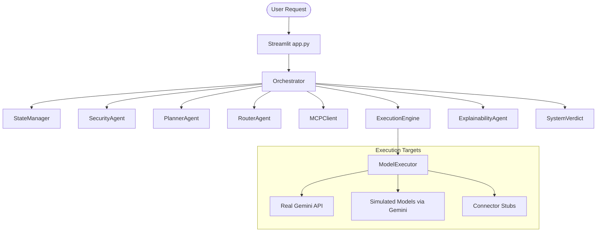
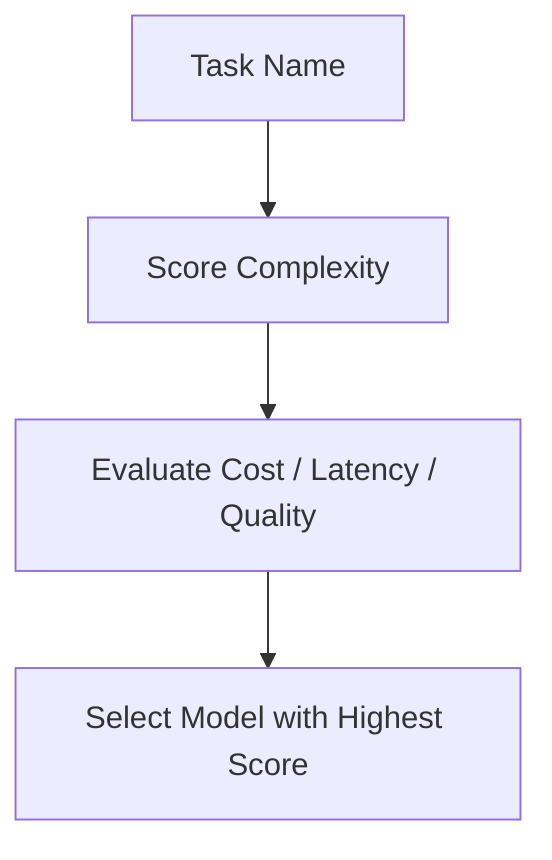

# HELIOS Architecture Documentation

This document describes the design, pipelines, agent flows, modes, and components of the HELIOS Multi-Agent Compute Orchestration system.

## System Architecture

## Agent Flow and Execution Pipeline

1. **Security**: Request is validated by `SecurityAgent` (Keyword filter in SAFE mode, LLM evaluate in DEMO mode).
2. **Planning**: `PlannerAgent` transforms the user goal into a DAG of atomic execution tasks.
3. **Task Loop**: For each task:
   - **Router**: `RouterAgent` assigns the optimal model.
   - **MCP**: `MCPClient` injects execution context via the pluggable `ContextProvider` architecture.
   - **Execution**: `ExecutionEngine` and `ModelExecutor` run the task on the selected target.
4. **Explainability**: `ExplainabilityAgent` generates an audit report showing decision rationales.
5. **Verdict**: `SystemVerdict` calculates total cost and clamps the efficiency savings against a baseline model.
6. **UI View**: Updates are updated in real-time on the Streamlit dashboard in a structured layout.

## Model Routing Pipeline

## Mode System

- **SAFE mode**: Operates locally. Employs deterministic regex filters for safety, rule-based fallbacks for routing, mock context extraction, and mock task outputs. No Gemini API keys are required.
- **DEMO mode**: Operates on live LLM interaction. Enforces API keys, utilizing the modern `google.genai` SDK for security vetting, dynamic planning, LLM routing, active context gathering, model execution simulation, and explainability auditing.

## Component Responsibilities

- **Orchestrator**: Acts as the central system coordinator.
- **StateManager**: Houses logs, task DAGs, routing logs, and outputs.
- **MCPClient**: Orchestrates context collection using the new `ContextProvider` abstraction.
- **ContextProvider / GeminiProvider**: Provides pluggable context backends.
- **ModelExecutor**: Routes execution to actual API endpoints, simulation prompts, or connector stubs.
